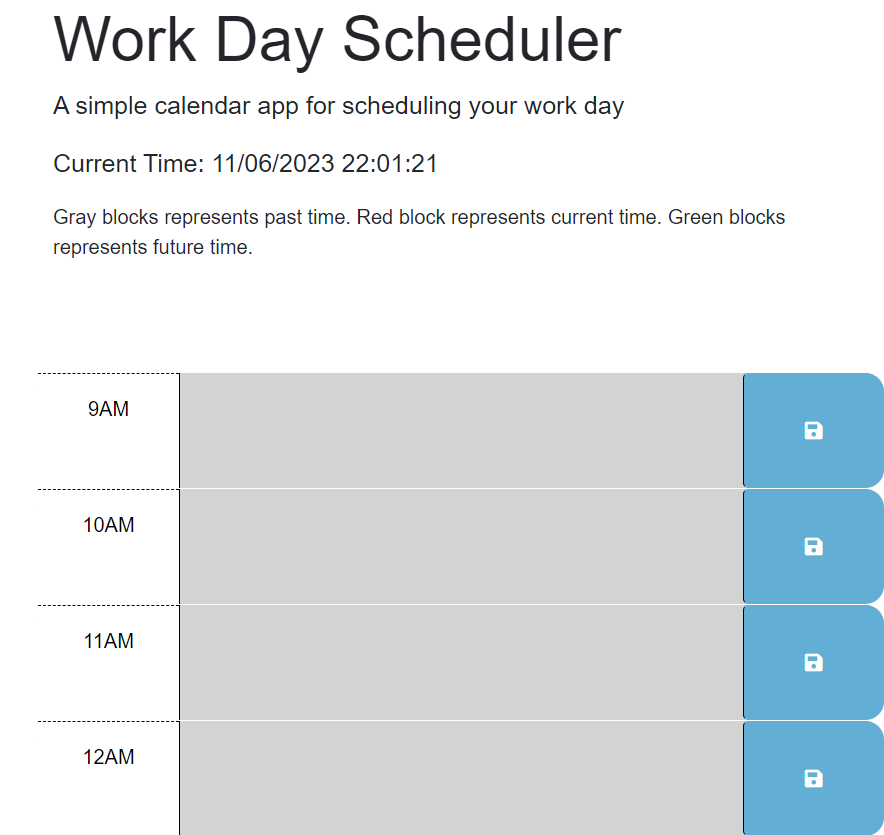
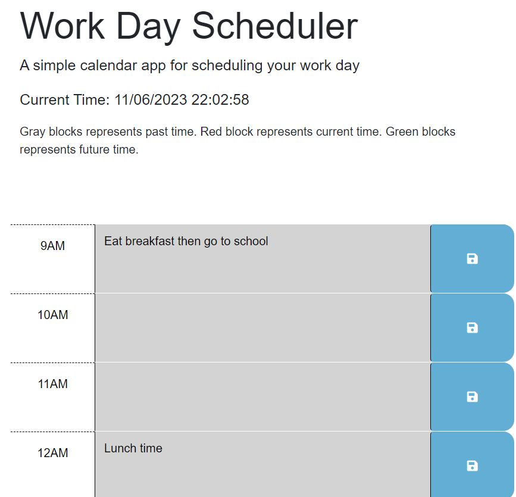

# Work Day Scheduler

## Description

This work day scheduler built utilizing jquery, bootstrap and javascript was created by Yilun Fan for study use.

## Installation

N/A

## Usage

To use this application, input texts in the text area of time block, and click the save button in the right side to save the text to local storage so the text will persist and render to the page even after you refresh or close this page.
Gray blocks represents past time. Red block represents current time. Green blocks represents future time. The current time will be print to the top of the page.

## Credits

N/A

## License

N/A

## Link to this application

Deployed Application: https://ylf456.github.io/module-5-challenge-ylf456/

Online Repo: https://github.com/ylf456/module-5-challenge-ylf456.git

## Screenshots

